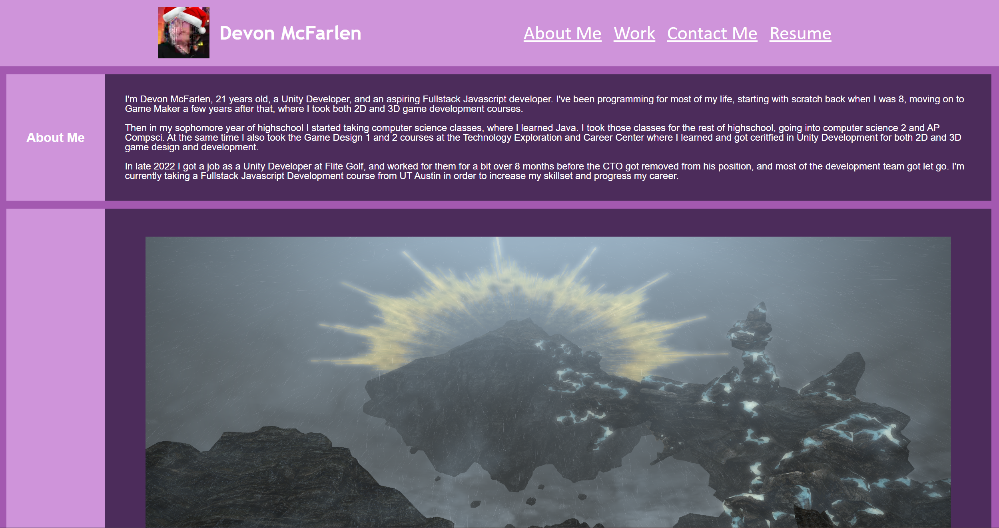

# UTA Module 2 Professional Portfolio

## Description

I made this to have a working professional portfolio to add to over time, for prospective employers to
look at. I made it in a way so that I can easily add additonal content to the website, and everything should
continue to be spaced properly. 
 
It helped me learn to properly space elements within CSS using flex-box, especially getting images to resize
and move around properly.

## Usage

Link to the webpage: https://devonmcfarlen.github.io/UTA-bootcamp-module1-HTML-CSS-GIT/

## License

MIT License